# Creating Virtual Machine
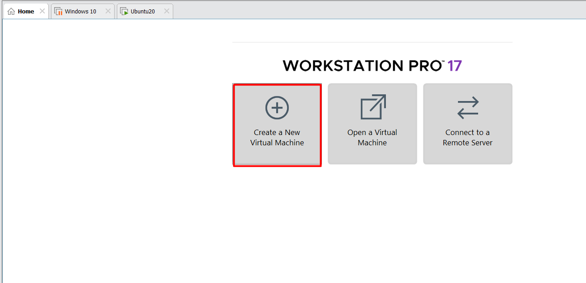

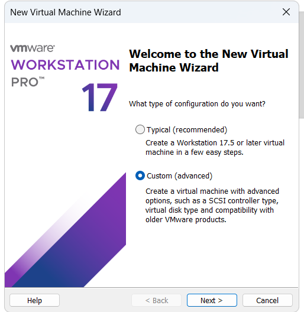

# Browse to the location of your ISO image
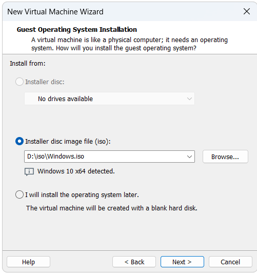

# Name your VM and provide location
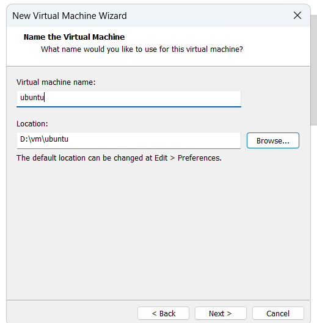

# Select BIOS
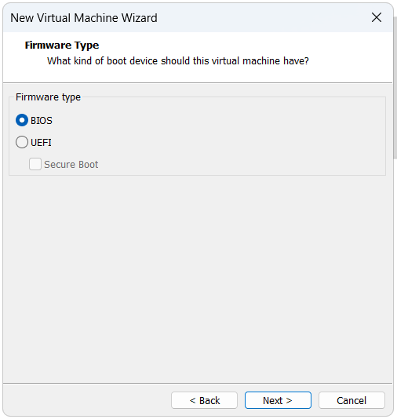

# Select number of processors
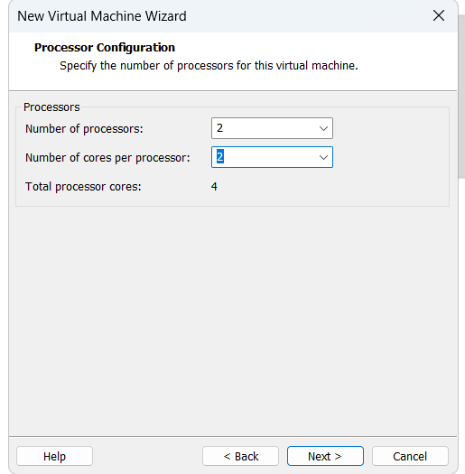

# Select amount of RAM
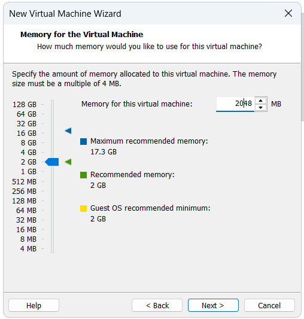

# Keep NAT as default
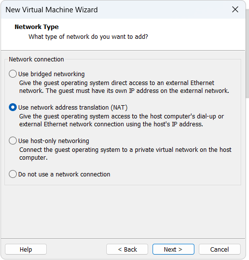

# Use recommended
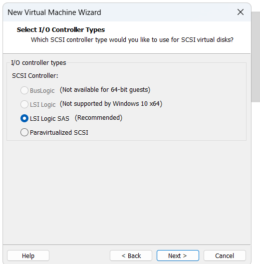

# Use SCSI as disk controller
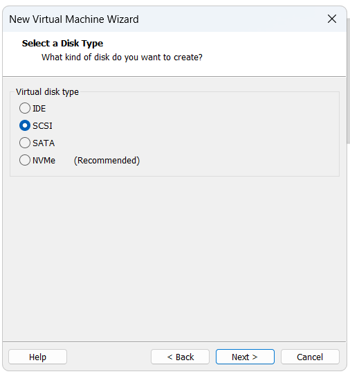

# Create a VM disk
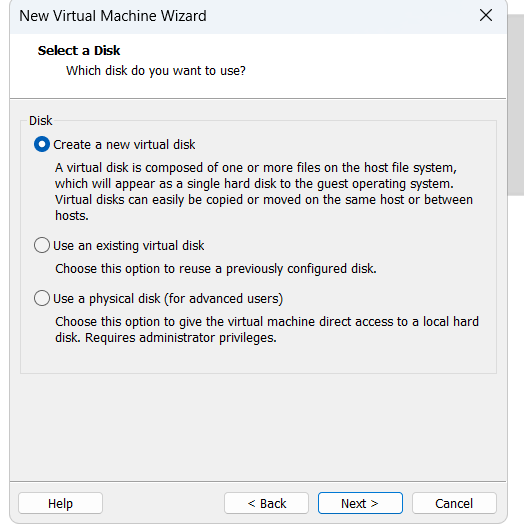

# Store as a single disk
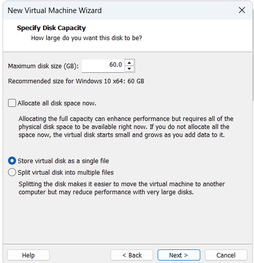

# Click finish to create
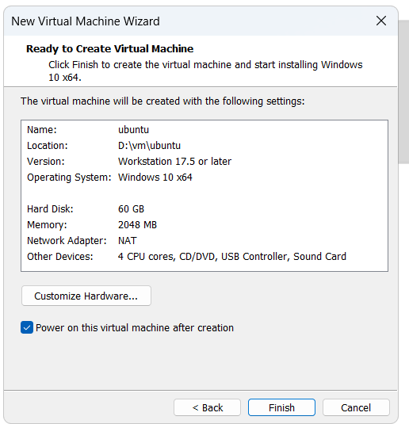

# wrong heading

